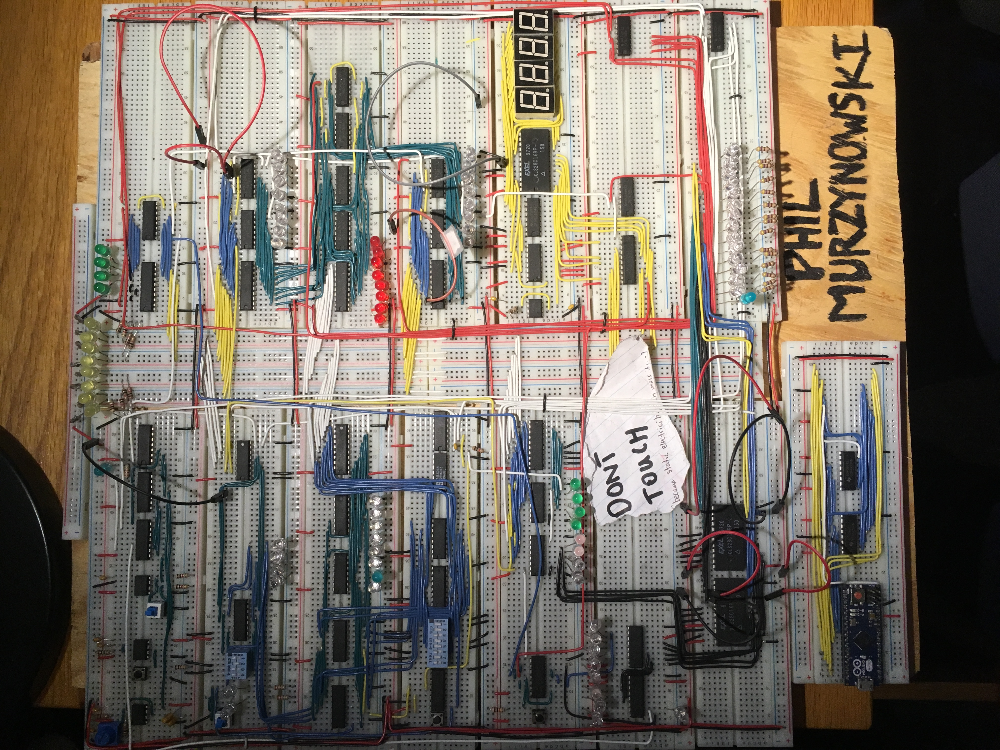
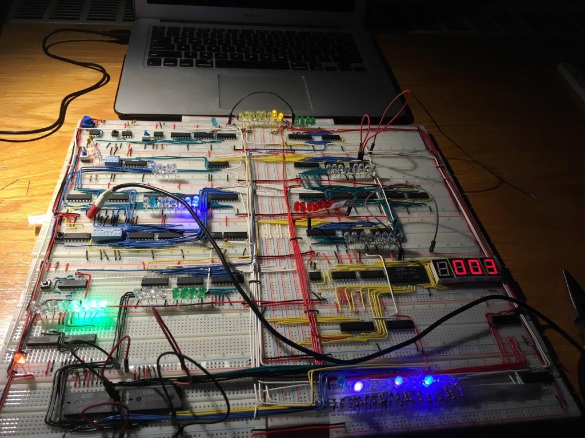

# 8-Bit CPU 
*Philip Murzynowski*
## Description
Brief showcase of a physical, programmable 8-bit computer built in 2017-2018 using transistor-transistor logic (TTL) and programmed with an EEPROM and Arduino. It was built as a learning experience following *But How Do It Know* by J. Clark Scott and Ben Eater's [Build an 8-bit computer](https://eater.net/8bit/) series. The build originally started in my free time but I just might have discovered somewhere along the way that it was far more engaging than the majority of my classes :eyes:. 
## Notes
Currently only images of final product are uploaded. Intermediate stages of build with descriptions will be uploaded for additional detail once I ship my backup drives XD. 
## Images

Topview of the 8-bit CPU build. Each entry in the table corresponds to one breadboard.

| | | |
| :---: | :---: |:---: |
| Clock module | BUS | [PC] Program Counter |
| [MAR] Memory Access Register | BUS | Register A|
| [RAM] Random Access Memory | BUS | [ALU] Arithmetic Logic Unit |
| Manual Data Input Logic | BUS | Register B |
| Instruction Register | BUS | 7-Segment Display |
| Control Unit | BUS | 7-Segment Register |
| EEPROM (Contains program) | BUS | Control Word LEDs |
| Arduino-based EEPROM Programmer | BUS | |

Action shot of the build (either starting fibonnaci or some kind of exponentation). On the right the red 7-segment display shows the current output. At the top the yellow LEDs show the data on the bus. In the middle-left section the blue LEDS show the data being loaded in from memory. In the bottom-left the green LEDs show the output of ringcounter used to display microinstruction steps within a given instruction. In the bottom-right blue LEDS show the bits in the active control word for the current microinstruction. LEDs on the middle-right section of the board are off indicating the registers and output of the ALU are currently all 0.